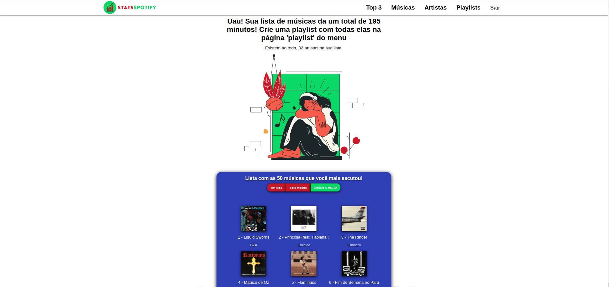

# Stats Spotify

Descubra as músicas e artistas que você mais escutou ao longo do tempo no Spotify. 🎶📊

## Visão Geral

Este projeto utiliza a API do Spotify para fornecer estatísticas personalizadas sobre a sua atividade musical. Com base na sua conta do Spotify, você poderá visualizar os artistas mais escutados, as músicas mais reproduzidas e criar playlists com suas faixas mais ouvidas em diferentes períodos de tempo, como um mês, seis meses ou em toda a sua história no Spotify.

## Funcionalidades

1. **Top Artistas:**
   - **Descrição:** Visualize a lista dos artistas mais escutados com base no seu histórico no Spotify. 🎤

2. **Top Músicas:**
   - **Descrição:** Descubra quais são as suas músicas mais ouvidas, apresentadas em uma lista fácil de entender. 🎵

3. **Criar Playlist Personalizada:**
   - **Descrição:** Crie playlists personalizadas com suas músicas mais escutadas em períodos específicos, como um mês, seis meses ou ao longo de toda a sua jornada musical. 🎶📅

4. **Filtragem por Período:**
   - **Descrição:** Escolha entre diferentes períodos de tempo (um mês, seis meses, All Time) para visualizar estatísticas específicas de acordo com suas preferências. ⏰

5. **Interface Responsiva:**
   - **Descrição:** Desfrute de uma interface amigável e responsiva, projetada para se adequar a diferentes dispositivos e tamanhos de tela. 📱💻

6. **Login Seguro do Spotify:**
   - **Descrição:** Faça login de forma segura usando a autenticação do Spotify para garantir a privacidade e a segurança dos seus dados. 🔐

## Como Usar

Para começar, envie seu email do Spotify para ter acesso ao beta da aplicação: moutimg@gmail.com

Uma vez enviado, aguarde confirmação e acesse o [deploy da aplicação no Vercel](https://stats-spotify-repo.vercel.app/). Faça login com sua conta do Spotify e aproveite as funcionalidades personalizadas.

## Tecnologias Utilizadas

- **React.js (com classes):** A biblioteca JavaScript para construção de interfaces de usuário, utilizada para criar uma experiência interativa e responsiva. ⚛️
- **JavaScript:** A linguagem de programação principal para manipulação e interação dinâmica na aplicação. 🚀
- **React Redux:** Uma biblioteca de gerenciamento de estado que facilita o compartilhamento de dados entre os componentes. 🔄
- **CSS:** Utilizado para estilizar e dar um design atraente à interface do usuário. 🎨
- **HTML:** A linguagem de marcação padrão para estruturar o conteúdo da aplicação. 📄
- **Spotify API:** A API oficial do Spotify que fornece acesso aos dados de usuários, permitindo a criação de experiências personalizadas. 🎵
